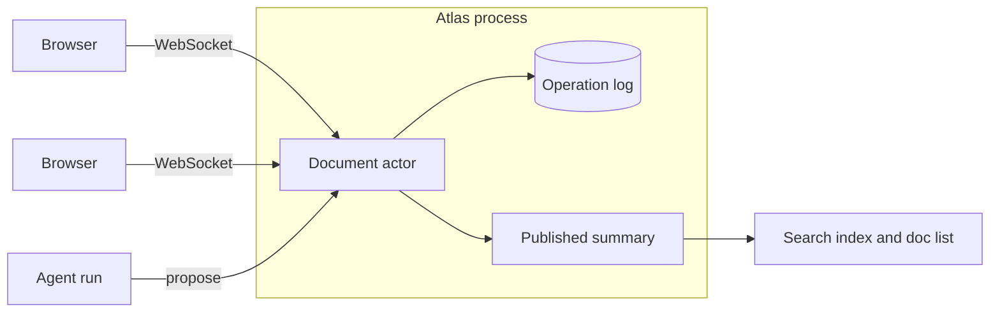

# Live docs: design

Live docs are shared plain-text documents inside Atlas. Several people edit
one at the same time, and agents take part as collaborators that propose
changes instead of making them. This note explains how it works, what was
decided against, and what is not done yet.

## Goals

- Many people typing in one document converge on the same text, whatever the
  network does.
- An edit is acknowledged only after it is on disk. A crash never loses an
  acknowledged edit and never applies one twice.
- A dropped connection costs nothing: edits made while offline are merged on
  reconnect.
- Agents work in the same document through the same ordering as people, and
  never change text without a person accepting the change.
- The history records who wrote every character, person or model.
- No new dependencies. The server stays standard-library Go and the console
  stays build-free JavaScript.

## Non-goals

- Rich text. Documents are plain text, which suits Markdown notes.
- Accounts and permissions. Names are taken on trust, as elsewhere in Atlas.
- Replication across machines. One process owns the documents. The log sits
  behind a small interface so a replicated one can replace it.
- Peer-to-peer or offline-first sync. There is always a server.

## Shape

Each document has one goroutine, its actor. Every change to that document
runs there, which gives all operations a single order. The actor drains
whatever is queued, applies it in memory, writes it to the log with one write
and one fsync, and only then releases acknowledgements and broadcasts. That
is group commit: under load, many edits share one fsync, and nothing a client
sees can be lost afterwards.

| Piece | File | Responsibility |
| --- | --- | --- |
| Operations | `internal/collab/ot.go`, `ui/ot.js` | apply, compose, transform, position mapping |
| Log | `internal/collab/oplog.go` | checksummed append-only records, recovery |
| State | `internal/collab/state.go` | text, authorship, suggestions, rebuilt by replay |
| Actor | `internal/collab/session.go` | ordering, batching, presence, the wire protocol |
| Transport | `internal/collab/ws.go` | RFC 6455 on the standard library |
| Agents | `internal/collab/agent.go`, `llm.go` | runs, staleness, budget, the two built-in agents |
| Client | `ui/collab.js` | the sync state machine, no DOM |
| Editor | `ui/docs.js` | the textarea, overlays, suggestions |

## Operations and convergence

An operation walks the whole document: retain n, insert text, delete n. On
the wire it is a JSON array, `[5,"abc",-2,10]`. Lengths are UTF-16 code
units, so the server and the browser agree on every index without
translation.

The server follows the Jupiter model. A client tags each operation with the
revision it was made against. The server transforms it across everything
committed since, applies it, and gives it the next revision number. A client
keeps at most one operation in flight and composes later edits into one
buffer; an operation arriving from the server is transformed across both.
When two inserts land on the same position, the incoming client operation
goes first, on both sides, which is what makes the tie-break agree.

Go and JavaScript implement the same algebra. A file of shared vectors
generated by the Go side (`internal/collab/testdata/ot_vectors.json`) is
checked by both test suites, so they cannot drift apart unnoticed.

## Reconnects, exactly once

Each operation carries an id chosen by its client, scoped on the server to
that client. If a connection drops with an operation in flight, the client
cannot know whether it was committed. On reconnect it says which revision it
holds and the server sends what it missed. If the operation is in that
history, it comes back carrying its id and the client treats that as the
acknowledgement. If it is not, the client sends it again, rebased. A resend
of something already committed is recognised by id and ignored. Ids are only
ever shown to the client that made them.

The client also watches for connections that die without saying so: a
handshake that never completes, an edit that is never acknowledged, or a
long silence. It answers each by reconnecting.

## Durability

The log is one file per document, one record per line: a CRC32, a space, and
JSON. Removing the first nine characters of each line gives JSON Lines.

- A partial last line is what a crash during an append leaves. It is removed
  on open and nothing before it is touched.
- Damage anywhere else means acknowledged history is unreadable. That
  document is set aside and reported; every other document still opens.
- If an append fails, the batch is truncated back out, the document's actor
  stops without acknowledging anything, and the next access rebuilds it from
  the file. Memory never stays ahead of disk.
- A second process on the same data directory is refused by a file lock.

There is no separate copy of the text. Replaying the log rebuilds the text,
the authorship of every character, and every suggestion. Live changes and
replay run through the same function, so a restart cannot disagree with what
clients saw.

## Agents

An agent reads a range at some revision, runs for as long as it needs outside
the actor, and returns text. By then the document has moved. That is the
slow-client problem, and the same machinery answers it: the range is carried
forward through every operation committed since the read.

Convergence is not enough for an agent, though. If someone rewrote the words
it was working on, its answer no longer means what it meant. So the server
tracks whether any operation edited the content of the range:

- **Untouched:** the result is posted as a pending suggestion.
- **Touched, first time:** the agent reads the text as it is now and tries
  once more.
- **Touched again:** the result is posted marked outdated. It can be
  dismissed or re-asked, never accepted.

A pending suggestion keeps tracking its range. Typing next to it moves it;
typing inside it makes it outdated. Accepting one commits an ordinary
operation authored by the agent, recording who asked and who accepted.

Two agents ship:

- **Librarian** searches the Atlas index for work related to the selection
  and proposes a short list. It is deterministic and needs no model.
- **Writer** calls any OpenAI-compatible chat endpoint (vLLM, Ollama, a
  hosted API) to rewrite the selection. Start Atlas with `-llm-url` and
  `-llm-model`; the key is read from `ATLAS_LLM_API_KEY`.

Document text can contain instructions aimed at the model. The Writer's
prompt fences everything from the document in tags with a random suffix the
text cannot guess, and says to treat it as material. The stronger protection
is structural: an agent has no tool that changes anything, its only output is
a suggestion, and each document has an hourly cap on agent runs.

## Alternatives considered

- **CRDT instead of OT.** A CRDT needs no central order and suits
  peer-to-peer and long offline work. Atlas already has a server, and with a
  server OT is smaller: no per-character identifiers, no tombstones, and the
  log is a plain list of edits that doubles as the provenance record.
- **Storing documents in the Raft KV.** The KV in this repo is put and delete
  only, keeps its whole log in memory, and has followers rewrite their log
  file on every append. A document log needs conditional append and
  truncation after a snapshot. The log interface is the seam for that work.
- **A WebSocket library.** The repo builds with the standard library alone,
  and the subset needed here is about 250 lines.
- **An editor component.** The console has no build step. A textarea with a
  mirrored overlay gives carets, selections and highlights without one. Its
  costs are listed below.

## Verification

- `go test -race ./internal/collab` includes a simulator that drives a real
  document actor and model clients through seeded random schedules: edits,
  reordered delivery, dropped connections, resends, late messages from dead
  connections, agent proposals against moved text, accepts and rejects. Every
  run must end with identical text everywhere and a log replay that
  reproduces the live state. `ATLAS_SIM_SEEDS=40000` runs more schedules.
- `node --test internal/atlas/uitests/ot.test.js` holds the browser OT to the
  Go implementation.
- `node internal/atlas/uitests/e2e.js` runs the real binary and the real
  browser client over real WebSockets, with delayed and cut connections and a
  SIGKILL of the server in the middle, then checks every editor against the
  server.
- `node internal/atlas/uitests/load.js` measures acknowledgement latency for
  many documents with a few editors each.

## Known limits

- **Replay cost.** Every operation copies the text, so opening a document
  costs history times size. Twenty thousand keystrokes on a twelve-thousand
  character document replay in about a second on two cores. Snapshots are the
  fix and are not built.
- **Memory.** Every document and its full history stay in memory, with one
  goroutine and one open file each.
- **No authentication.** Anyone who can reach the server can read and edit.
  Use `-origins` to stop other websites from calling a shared runtime through
  a member's browser, and keep it on a trusted network.
- **Editor.** Undo history is lost when a remote edit arrives. Repainting the
  overlay is linear in document size and gets slow in the hundreds of
  thousands of characters. Overlay alignment was checked in Chromium only.
- **Torn writes.** Recovery assumes a crash leaves a prefix of the last
  append. A filesystem that persists a later block without an earlier one
  would be reported as damage.
- **Agents** write only through suggestions. Letting an agent own a block,
  such as a results table a job keeps current, is the natural next step.
